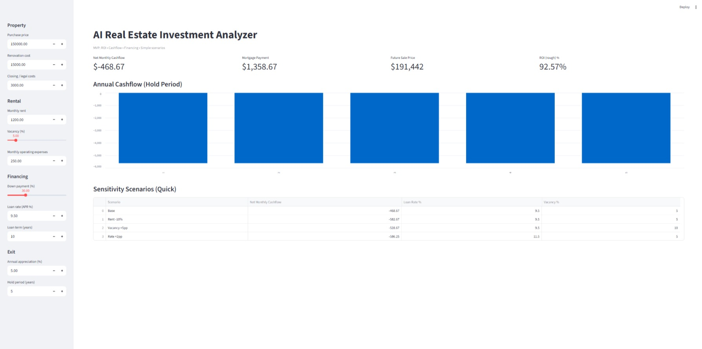

# 🧠 AI Real Estate Investment Analyzer  
### Advanced ROI, IRR, Cashflow & Exit Modeling Engine for Property Investors

---

## 🚩 The Problem

Real estate investments are often evaluated using rough estimates or spreadsheets with limited scenario testing.  
This leads to:

- Overestimated returns  
- Ignored financing risks  
- Poor cashflow planning  
- Weak investor presentations  

Investors need **structured, repeatable, data-driven analysis**.

---

## 💡 The Solution

**AI Real Estate Investment Analyzer** is a financial modeling engine that converts property inputs into clear investment intelligence.

It automates:

✔ True ROI calculations  
✔ IRR (Internal Rate of Return)  
✔ Cashflow modeling  
✔ Loan leverage impact  
✔ Exit modeling with remaining loan balance  
✔ Risk sensitivity scenarios  
✔ Net sale proceeds analysis  

This tool transforms raw property numbers into **decision-grade insights**.

---

## 🏗 Core Features

| Module | What it Does |
|--------|--------------|
| **Profitability Engine** | Calculates ROI and IRR based on full investment cycle |
| **Cashflow Model** | Projects monthly and annual net income |
| **Financing Simulator** | Shows impact of loan terms and leverage |
| **Exit Modeling** | Sale price, remaining loan, and net investor proceeds |
| **Risk Sensitivity** | Vacancy, rent, and interest rate stress tests |
| **AI Investment Insight** | Automatically interprets investment risk profile |
| **Visual Dashboard** | Interactive modeling interface |

---

## 🖥 Dashboard Preview

### Dashboard Overview



The dashboard allows users to input:

- Purchase price  
- Renovation costs  
- Closing costs  
- Down payment  
- Loan interest rate & term  
- Monthly rent  
- Vacancy rate  
- Operating expenses  
- Expected appreciation  
- Investment hold period  

And instantly see:

📈 IRR & ROI  
💰 Monthly Cashflow  
🏁 Net Sale Proceeds  
⚖ Risk Scenarios  
📊 Cashflow over hold period  

---

## 🎯 Who This Is For

- Real estate developers  
- Property investors  
- Investment funds  
- Brokers preparing investor packages  
- Agencies offering financial analysis services  

---

## 💼 Business Impact

This system is designed to:

- Reduce property evaluation time by **80%+**  
- Improve investment decision quality  
- Support investor presentations with structured data  
- Replace manual spreadsheet analysis  

---

## ⚙️ Tech Stack

- Python  
- NumPy Financial  
- Streamlit Dashboard  
- Financial modeling engine  

---

## 🚀 Getting Started

### 1️⃣ Install dependencies

```bash
pip install -r requirements.txt
